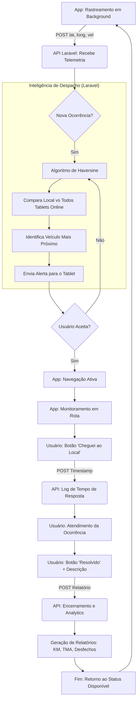

# Visão do Produto e Fluxo de Operação - UMS Mobile

Este documento detalha o funcionamento sistêmico do ecossistema **UMS Logistics**, abrangendo a captura de dados no aplicativo, a inteligência de roteamento no backend Laravel e o ciclo de vida das ocorrências.

---

## 1. Arquitetura de Rastreamento (Mobile -> API)

O aplicativo opera sob o padrão **"Wi-Fi First"**, garantindo que nenhum dado de telemetria seja perdido em zonas de sombra.

*   **POST de Telemetria:** O app envia continuamente para o endpoint `/api/gps/track` os seguintes dados:
    *   `latitude` e `longitude`: Capturadas via `expo-location`.
    *   `velocidade`: Calculada em tempo real (m/s convertidos para km/h).
    *   `id_patrimonio`: Identificador único do veículo/tablet.
    *   `timestamp`: Momento exato da captura.
*   **Resiliência Offline:** Caso a API Laravel esteja inacessível, os pontos são armazenados no `AsyncStorage` e sincronizados automaticamente assim que a conexão é restaurada.

---

## 2. Fluxo de Operação (Diagrama)

O diagrama abaixo ilustra o ciclo completo, desde a telemetria em background até a resolução da ocorrência e geração de relatórios.

---

## 3. Inteligência de Despacho (Backend Laravel)

O "cérebro" do sistema reside na API, que gerencia a frota e os locais de votação.

### 2.1. O Algoritmo de Haversine
Quando uma ocorrência é registrada em um local de votação, o servidor executa um algoritmo de roteamento baseado na **Fórmula de Haversine**. 
*   **Lógica:** O backend calcula a distância de círculo máximo entre as coordenadas da ocorrência (Ponto A) e a última posição conhecida de todos os tablets conectados (Pontos B).
*   **Seleção:** O sistema identifica o veículo que possui a menor distância linear e está em status "Disponível".
*   **Notificação:** A API dispara um sinal (via WebSockets ou Long Polling) para o tablet selecionado.

---

## 3. Ciclo de Vida da Ocorrência no App

O fluxo de trabalho do operador de campo segue quatro estados fundamentais:

1.  **Aguardando (IDLE):** O app apenas transmite GPS em background.
2.  **Despacho Recebido (PENDING):** 
    *   O usuário visualiza o `DispatchModal` com detalhes da ocorrência e prioridade.
    *   Ao **Aceitar**, o app inicia o modo de navegação ativa.
3.  **Em Rota (ACTIVE):**
    *   O mapa (`MapViewOSM`) destaca a rota até o destino.
    *   O sistema monitora a aproximação.
    *   **Chegada no Local:** O usuário aciona o botão "Cheguei ao Local", registrando o timestamp de chegada para fins de KPI de tempo de resposta.
4.  **Resolução (RESOLVING):**
    *   Após o atendimento, o usuário preenche o relatório de desfecho.
    *   **Finalização:** O usuário descreve como o problema foi resolvido (ex: "Troca de urna concluída", "Suporte técnico finalizado").
    *   O app volta ao estado **Disponível**.

---

## 4. Relatórios e Inteligência de Dados

Todos os dados coletados permitem a emissão de relatórios gerenciais detalhados na plataforma administrativa:

*   **Quilometragem Percorrida:** Cálculo acumulado baseado nos vetores de deslocamento enviados pelo GPS.
*   **Tempo Médio de Atendimento (TMA):** Diferença entre o aceite, a chegada e a resolução.
*   **Produtividade por Veículo:** Ranking de ocorrências resolvidas por equipe.
*   **Heatmap de Ocorrências:** Visualização geográfica de onde os problemas estão concentrados (locais de votação com maior demanda).

---

## 5. Padrões Técnicos Aplicados

*   **Idioma:** Toda a lógica de negócio e comentários seguem o padrão **Português**.
*   **Documentação:** Uso rigoroso de **JSDoc** para descrever as interfaces de dados entre o app e a API Laravel.
*   **UI/UX:** Interface responsiva otimizada para tablets Samsung, garantindo legibilidade em condições de campo.

---
*Documento gerado como referência arquitetural para o projeto UMS Mobile.*
